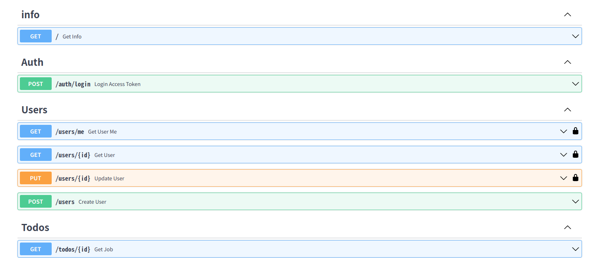

# リポジトリ

今回説明する内容を含んだ実用的な FastAPI テンプレートは以下のリポジトリに Push しています。

https://github.com/takashi-yoneya/fastapi-template

# OpenAPI Generator を使うと何が嬉しいか？

Typescrip 以外で実装したバックエンド API の型情報は、フロントエンドと共通できないため、それぞれで重複して定義する必要があり、フロントとバックで型に差異が生まれてしまうなどの問題がありました。

OpenAPI Generator を使用することで、バックエンドの実装から、フロントエンドの型情報を自動的に生成することができます。
また、API 実行用の関数も自動生成できるので、フロントエンドの API 連携の開発体験が最高に高まります。

# 前提となる用語(ご存知の方は読み飛ばして OK)

## OpenAPI とは

OpenAPI は、json や yaml で記述可能な、REST API の記述形式です。
API の仕様をファイルで表現でき、Swagger 等のツールを使えば、API の実行検証も可能です。

## FastAPI と OpenAPI

FastAPI は、Python 用のバックエンド API フレームワークです。
OpenAPI は便利ではありますが、json を直接記述するのは面倒です。

FastAPI では、API(router)を作成すると、自動的に OpenAPI 準拠の json ファイルが作成され、以下のような Swagger 画面で API 仕様が確認できます。



## OpenAPI Generator とは

OpenAPI 仕様のファイルを読み込んで、フロント用のコードを自動で生成できるツールです。

公式リポジトリ
https://github.com/OpenAPITools/openapi-generator-cli

# OpenAPI Generator の実装

## OpenAPI Generator を使用した API の型情報の生成

FastAPI を使用すると、API のインターフェースの schema 情報が openapi.json として自動生成されます。

OpenAPI Generator を使用すると、openapi.json から react.js(.ts)のコードが自動生成できます。

型情報だけではなく、API を実行するための関数も自動生成されます。

FastAPI(pydantic)の schema 実装

```py
class TodoResponse(BaseSchema):
    title: Optional[str]
    description: Optional[str]
    completed_at: Optional[datetime.datetime]
```

React.js の型定義のコード（自動生成）

```ts
/**
 *
 * @export
 * @interface TodoResponse
 */
export interface TodoResponse {
  /**
   *
   * @type {string}
   * @memberof TodoResponse
   */
  title?: string;
  /**
   *
   * @type {string}
   * @memberof TodoResponse
   */
  description?: string;
}
```

FastAPI(pydantic)の router の実装

```py
@router.get("", response_model=schemas.TodosPagedResponse, operation_id="get_todos")
def get_todos(
    q: Optional[str] = None,
    paging: PagingQueryIn = Depends(),
    db: Session = Depends(get_db),
) -> schemas.TodosPagedResponse:
```

React.js の API 呼び出しコード（自動生成）

```ts
  /**
   *
   * @summary Get Todos
   * @param {string} [q]
   * @param {number} [page]
   * @param {number} [perPage]
   * @param {*} [options] Override http request option.
   * @throws {RequiredError}
   * @memberof TodosApi
   */
  public getTodos(
    q?: string,
    page?: number,
    perPage?: number,
    options?: AxiosRequestConfig
  ) {
    return TodosApiFp(this.configuration)
      .getTodos(q, page, perPage, options)
      .then((request) => request(this.axios, this.basePath));
  }
```

## OpenAPI Genrator を実行するための Docker コンポーネント

OpenAPI Generator を実行するためには Java 環境のインストールが必要ですが、公式の Docker を使用すると特に追加のインストールが不要で、OpenAPI Generator を実行することができます。

### Docker Compose のサンプル

`http://localhost:8000/openapi.json` の部分は、FastAPI サーバーの URL(openapi.json)を指定しますので、実行環境に合わせて適宜変更してください。

`docker compose up`でエラーになる場合は、上記の URL に疎通できていない可能性が高いです。

```yml
version: "3.7"

services:
  # openapiのclient用のコードを自動生成するコンテナ
  openapi-generator:
    image: openapitools/openapi-generator-cli
    volumes:
      - ./src:/src
    command: generate -i http://localhost:8000/openapi.json -g typescript-axios -o /src/api_clients --skip-validate-spec

```

# React.js の実装

## OpenAPI Generator で自動生成されるコード

OepnAPI Generator を実行すると、-o オプションで指定したディレクトリにコードが自動生成されます。

先程の例では、`/src/api_clients`の配下にコードが生成されます。

基本的に、こちらのコードは自動生成するごとに新しく上書きされるため、個別に修正する必要はありません。

## React への組み込み例

React からバックエンドの関数を実行するためには、以下の例のように自動生成された各 ApiClass をインスタンス化して ApiClient を作成するのが簡単です。

```./app```や```./configration```はOpenAPI Generatorで自動生成されたファイルです。


```ts
import { TodosApi, UsersApi } from "./api";
import { Configuration } from "./configuration";

const API_HOST = "http://localhost:8000";

const authConfig = new Configuration({
  basePath: API_HOST,
  baseOptions: { withCredentials: true },
});
const nonAuthConfig = new Configuration({
  basePath: API_HOST,
  baseOptions: { withCredentials: false },
});

export const UsersApiClient = new UsersApi(nonAuthConfig);
export const TodosApiClient = new TodosApi(nonAuthConfig);
```

ApiClient を使用してバクエンド API を実行するのは非常に簡単で、以下のように各 API の ApiClient のメソッドを呼び出すだけです。

```ts
const userResponse = UsersApiClient.getUserUsersIdGet("1");
userResponse.then((d) => d.data.email);

const request: TodoCreate = { title: "test" };
const todoResuponse = TodosApiClient.createTodo(request);
todoResuponse.then((d) => d.data.title);
```

なお、このメソッド名は FastAPI の router で定義した operation_id をキャメルケースに変換したものが自動で設定されます。
operation_id を指定しない場合は、router が path の構造を解析して自動的にメソッド名を生成します。

```py
@router.post("", ..., operation_id="create_todo")
```

## React Query を使った実装

React Query を使う場合は、hooks として ApiClient を組み込む必要があります。

Getの場合は、以下のような共通のuseGet関数を作成すると便利です。

```ts
export type UseGetResult<TData, TError = ErrorResponse> = Omit<
  UseQueryResult<AxiosResponse<TData>, AxiosError<TError>>,
  "data" | "error"
> & {
  data?: TData;
  error?: TError;
};

export const useGet = <TData, TError = ErrorResponse>(
  key: unknown[] | string,
  queryFn: QueryFunction<AxiosResponse<TData>>,
  options?: UseQueryOptions<AxiosResponse<TData>, AxiosError<TError>>
): UseGetResult<TData, TError> => {
  const result = useQuery<
    AxiosResponse<TData>,
    AxiosError<TError>,
    AxiosResponse<TData>
  >(key, queryFn, options);
  return {
    ...result,
    data: result.data?.data,
    error: result.error?.response?.data,
  };
};
```

各 API 毎に、以下のように関数を作成して、上記の useGet 経由で ApiClient を呼び出すようにするのが簡単です。

```ts
export const useGetTodoById = (id?: string): UseGetResult<TodoResponse> =>
  useGet([`/todos`, id], async () =>
    id ? TodosApiClient.getTodoById(id) : Promise.reject()
  );
```

後は、component などから、以下のように呼び出すことで、簡単にデータが取得できます。

```ts
const { data: todoResponse } = useGetTodoById(router.query.id as string);
// 結果表示のためのサンプル
useEffect(() => {
  todosResponse?.data?.map((d) => console.log(d.title));
}, [todosResponse]);
```

細かな実装は、説明すると長くなってしまうので、以下の当方のリポジトリを参考にしていただければと思います。

https://github.com/takashi-yoneya/fastapi-template

※FastAPI,React を使った実用的な実装テンプレートです。
